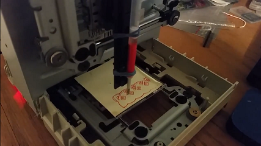

# plotter
## Dependencies
* cv2
* numpy

## Usage
```
python main.py image.png -ch
```

### Options
```
-ch crosshatch mode
-p makes a image preview. Doesn't physically print anything
```

[](https://www.youtube.com/watch?v=Q-gjmmHBCXA)
